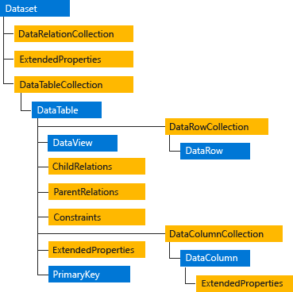

# ADO.NET

In this chapter, You will learn about ADO.NET:

* ADO.NET is a data access technology from the Microsoft .NET Framework 
* ADO is the acronym for **ActiveX Data Objects**
* ADO.NET includes .NET Framework data providers for connecting to a database, executing commands, and retrieving results.
* The ADO.NET classes are found in `System.Data.dll`, and are integrated with the XML classes found in `System.Xml.dll`

### ADO.NET Components

The two main components of ADO.NET for accessing and manipulating data
* .NET Framework data providers
* The DataSet

#### .NET Framework data providers

The following table outlines the four core objects that make up a .NET Framework data provider.


Object | Description
---------|----------
`Connection` | Establishes a connection to a specific data source. The base class for all `Connection` objects is the `DbConnection` class 
`Command` | Executes a `command` against a data source. Exposes `Parameters` and can execute in the scope of a Transaction from a `Connection`. The base class for all `Command` objects is the `DbCommand` class.
`DataReader` | Reads a forward-only, read-only stream of data from a data source. The base class for all `DataReader` objects is the `DbDataReader` class.
`DataAdapter` | Populates a `DataSet` and resolves updates with the data source. The base class for all `DataAdapter` objects is the `DbDataAdapter` class.

#### DataSet

* The ADO.NET `DataSet` is explicitly designed for data access independent of any data source.
* As a result, it can be used with multiple and differing data sources, used with `XML` data, or used to manage data local to the application.
* The `DataSet` contains a collection of one or more `DataTable` objects consisting of rows and columns of data, and also primary key, foreign key, constraint, and relation information about the data in the `DataTable` objects

The following diagram illustrates the relationship between a .NET Framework data provider and a `DataSet`.



### Command Class

The `Command` class provides methods for storing and executing SQL statements and Stored Procedures. The following are the various commands that are executed by the `Command` Class.

* `ExecuteReader`: Returns data to the client as rows. This would typically be an SQL select statement or a Stored Procedure that contains one or more select statements. This method returns a DataReader object that can be used to fill a `DataTable` object or used directly for printing reports and so forth.
* `ExecuteNonQuery`: Executes a command that changes the data in the database, such as an update, delete, or insert statement, or a Stored Procedure that contains one or more of these statements. This method returns an integer that is the number of rows affected by the query.
* `ExecuteScalar`: This method only returns a single value. This kind of query returns a count of rows or a calculated value.
* `ExecuteXMLReader`: Obtains data from an database using an XML stream. Returns an XML Reader object.

### Example to understand ADO.NET using Stored Procedure in C#:

Let us understand how to use the Stored Procedure in C# with one example. We are going to use the following Student table in this demo to understand the concept of **ADO.NET** using Stored Procedure.

#### Creating Database and Table in SQL Server

Please use the below SQL Script to Create and Populate the database `StudentDB` and table Student with the required sample data.

```sql
CREATE DATABASE StudentDB;
GO

USE StudentDB;
GO

CREATE TABLE Student(
 [Id] [int] IDENTITY(100,1) PRIMARY KEY,
 [Name] [varchar](100) NULL,
 [Email] [varchar](50) NULL,
 [Mobile] [varchar](50) NULL,
)
GO

INSERT INTO Student VALUES ('Ravi','Ravi001@gmail.com','1234567890')
INSERT INTO Student VALUES ('Priyanka','Priyanka10@gmail.com','2233445566')
INSERT INTO Student VALUES ('Preethi','Preethi555@gmail.com','6655443322')
INSERT INTO Student VALUES ('Arun','Arun@yahoo.com','9876543210')
```
#### Creating Stored Procedure without Parameters

 Let us create a stored procedure that will not take any input parameter but will return all the records from the Student table. Please use the below SQL Script to create the stored procedure in the SQL server StudentDB database.

```sql
CREATE PROCEDURE spGetStudents
AS
BEGIN
     SELECT Id, Name, Email, Mobile
     FROM Student
END
```
#### Example to Call a Stored Procedure using C# ADO.NET

Let's see how to call a stored procedure without any parameters in C#

```cs
namespace ADOUsingStoredProcedure
{
    class Program
    {
        static void Main(string[] args)
        {
            try
            {
                string ConnectionString = @"data source=localhost; database=StudentDB; user id=sa; password=admin@123";

                using (SqlConnection connection = new SqlConnection(ConnectionString))
                {
                    SqlCommand cmd = new SqlCommand("spGetStudents", connection)
                    {
                        CommandType = CommandType.StoredProcedure
                    };

                    connection.Open();
                    Int32 count = Convert.ToInt32 = cmd.ExecuteReader();
                    Console.WriteLine(" No. of Rows " + count);
                 
                }
            }
            catch (Exception ex)
            {
                Console.WriteLine($"Exception Occurred: {ex.Message}");
            }
            Console.ReadKey();        
        }
    }
}
```

#### Example to Call a Stored Procedure with Input Parameter in C#:

Let's see how to call a stored procedure with input parameter in C#

First let's create a stored procedure which accepts an input parameter:

```sql
CREATE PROCEDURE spGetStudentById
(
   @Id INT
)
AS
BEGIN
     SELECT Id, Name, Email, Mobile
     FROM Student
     WHERE Id = @Id
END
```
Now let's create a C# program to call the stored procedure with id as input parameter

```cs
public class Program
{
    public static void Main(string[] args)
    {
        try
        {
            
            string ConnectionString = @"data source=localhost; database=StudentDB; user id=sa; password=admin@123";

            using (SqlConnection connection = new SqlConnection(ConnectionString))
            {                 
                SqlCommand cmd = new SqlCommand()
                {
                    CommandText = "spGetStudentById", 
                    Connection = connection, 
                    CommandType = CommandType.StoredProcedure
                };
                
                SqlParameter param1 = new SqlParameter
                {
                    ParameterName = "@Id", 
                    SqlDbType = SqlDbType.Int, 
                    Value = 101, 
                    Direction = ParameterDirection.Input 
                };
                
                cmd.Parameters.Add(param1);
                
                connection.Open();
            
                SqlDataReader sdr = cmd.ExecuteReader();
                
                while (sdr.Read())
                {                     
                    Console.WriteLine(sdr["Id"] + ",  " + sdr["Name"] + ",  " + sdr["Email"] + ",  " + sdr["Mobile"]);                      
                }
            }
        }
        catch (Exception ex)
        {
            Console.WriteLine($"Exception Occurred: {ex.Message}");
        }
        Console.ReadKey();
    }
}
```
#### Example to Call a Stored Procedure with SQL Data Adapter:

Now let's use SQL Data Adapter to call the stored procedure:

```cs
public class Program
{
    public static void Main(string[] args)
    {
        try
        {
            string ConString = @"data source=localhost; database=StudentDB; user id=sa; password=admin@123";
            using (SqlConnection connection = new SqlConnection(ConString))
            {

                SqlDataAdapter da = new SqlDataAdapter("spGetStudents", connection);
                da.SelectCommand.CommandType = CommandType.StoredProcedure;

                DataTable dt = new DataTable();
                da.Fill(dt);
                foreach (DataRow row in dt.Rows)
                {
                    Console.WriteLine(row["Name"] + ",  " + row["Email"] + ",  " + row["Mobile"]);
                }
            }
        }
        catch (Exception e)
        {
            Console.WriteLine("OOPs, something went wrong.\n" + e);
        }
        Console.ReadKey();
    }
}   
```
#### Example to Call a Stored Procedure with Execute Scalar:

Executes the query, and returns the first column of the first row in the result set returned by the query. Additional columns or rows are ignored.

```cs
public class Program
{
    public static void Main(string[] args)
    {
        try
        {
            string ConnectionString = @"data source=localhost; database=StudentDB; user id=sa; password=admin@123";

            using (SqlConnection connection = new SqlConnection(ConnectionString))
            {
                SqlCommand cmd = new SqlCommand("spGetStudents", connection)
                {
                    CommandType = CommandType.StoredProcedure
                };

                connection.Open();
                Int32 count = Convert.ToInt32(cmd.ExecuteScalar());
                Console.WriteLine("First Row First Column Value" + count);
            }
        }
        catch (Exception ex)
        {
            Console.WriteLine($"Exception Occurred: {ex.Message}");
        }
        Console.ReadKey();
    }
}   
```

