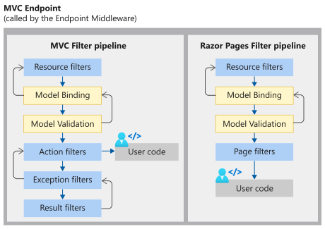

# ASP.NET Core

ASP.NET Core is a cross-platform, high-performance, open-source framework for building modern, cloud-enabled, Internet-connected apps.

With ASP.NET Core, you can:

* Build **web apps** and **services**, **Internet of Things (IoT)** apps, and **mobile backends**
* Use your favorite development tools on `Windows`, `macOS`, and `Linux`
* Deploy to the `cloud` or `on-premises`
* Run on `.NET Core`

### Benefits of ASP.NET Core

ASP.NET Core provides the following benefits:
* Build Web UI
* Build Web APIs
* **Razor Pages** makes coding page-focused scenarios easier and more productive
* **Blazor** lets you use C# in the browser alongside JavaScript. Share server-side and client-side app logic all written with .NET.
Ability to develop and run on `Windows`, `macOS`, and `Linux`
* Open-source
* Integration of modern, client-side frameworks and development workflows (`Angular`, `React`, `Bootstrap`)
* Support for hosting **Remote Procedure Call (RPC)** services using **gRPC**
* A cloud-ready, environment-based configuration system
* Built-in dependency injection
* A lightweight, high-performance, and modular HTTP request pipeline
* Ability to host on the following:
    * `Kestrel`
    * `IIS`
    * `HTTP.sys`
    * `Nginx`
    * `Apache`
    * `Docker`


### ASP.NET Core Application Types


### ASP.NET vs ASP.NET Core Comparison

The following table compares ASP.NET Core to ASP.NET 4.x.

ASP.NET Core | ASP.NET 4.x
---------|----------
Build for Windows, macOS, or Linux | Build for Windows
Razor Pages is the recommended approach to create a Web UI as of ASP.NET Core 2.x | Use Web Forms, SignalR, MVC, Web API, WebHooks, or Web Pages
Multiple versions per machine | One version per machine
Develop with Visual Studio, Visual Studio for Mac, or Visual Studio Code using C# or F# | Develop with Visual Studio using C#, VB, or F#
Higher performance than ASP.NET 4.x | Good performance
Use .NET Core runtime | Use .NET Framework runtime

### .NET vs .NET Framework Comparison

The following table compares .NET to .NET Framework

 .NET | .NET Framework
---------|----------
Cross Platform (Windows, Linux & Mac) | Runs on Windows Only 
Open-Source. Anybody can contribute code | Does not take direct contributions
Shipped independently | Installed and updated as part of Windows
Use for New API, Microservices, Container Apps | Continue to extend for existing .NET framework apps

## Fundamentals

Below are the fundamentals for building ASP.NET Core apps:


### App Startup

ASP.NET Core apps created with the web templates contain the application startup code in the `Program.cs` file. The `Program.cs` file is where:

* `Services` required by the app are configured.
* The app's request handling pipeline is defined as a series of `middleware` components.

The following is the sample app startup code in `Program.cs`

```cs
var builder = WebApplication.CreateBuilder(args);

// Add services to the container.
builder.Services.AddRazorPages();
builder.Services.AddControllersWithViews();

var app = builder.Build();

// Configure the HTTP request pipeline.
if (!app.Environment.IsDevelopment())
{
    app.UseExceptionHandler("/Error");
    app.UseHsts();
}

app.UseHttpsRedirection();
app.UseStaticFiles();

app.UseAuthorization();

app.MapGet("/hi", () => "Hello!");

app.MapDefaultControllerRoute();
app.MapRazorPages();

app.Run();
```

### Dependency Injection

ASP.NET Core is designed from scratch to support **Dependency Injection**. ASP.NET Core injects objects of dependency classes through constructor or method by using built-in `IoC container`

The built-in container is represented by `IServiceProvider` implementation that supports constructor injection by default. The types (classes) managed by built-in IoC container are called **services**

There are basically two types of services in ASP.NET Core:

* **Framework Services:** Services which are a part of ASP.NET Core framework such as `IApplicationBuilder`, `IHostingEnvironment`, `ILoggerFactory` etc.

* **Application Services:** The services (custom types or classes) which you as a programmer create for your application.

In order to let the IoC container automatically inject our application services, we first need to register them with IoC container.

#### Understanding Service Lifetime

Built-in IoC container manages the lifetime of a registered service type. It automatically disposes a service instance based on the specified lifetime.


The built-in IoC container supports three kinds of lifetimes:

* **Singleton**: IoC container will create and share a single instance of a service throughout the application's lifetime.
* **Transient**: The IoC container will create a new instance of the specified service type every time you ask for it.
* **Scoped**: IoC container will create an instance of the specified service type once per request and will be shared in a single request.

```cs
builder.Services.AddTransient<ICategoryRepository, CategoryRepository>();
builder.Services.AddScoped<ICategoryRepository, CategoryRepository>();
builder.Services.AddSingleton<ICategoryRepository, CategoryRepository>();
```

#### Dependency Injection Example

Consider a scenario where you want to fetch all the categories from the database and want to show that in the UI layer. So, you will create a service, i.e., a Web API which will be called by the UI layer. Now, in API, we need to create one `GET` method which will call the repository and the repository talks with the database. In order to call the repository, we need to create an instance of the same in API GET method, which means, it’s mandatory to create an instance of the repository for API. We can say the instance of the repository is the dependency of API. Now, let’s see how we can inject this dependency in our core Web API.

* Open Visual Studio and create a new project
* Select API as template and press OK.
* As we are going to fetch the categories, let’s create a `Category` model 
* Create a folder `Models`
* Under `Models` folder, Create a `Category` class which has two fields - `CategoryId` and `CategoryName`.

```cs
public class Category
{
    public int CategoryId { get; set; }
    public string CategoryName { get; set; }
}
```

* Create a folder `Interface`
* Under Interface folder, create an interface of repository having `GetCategories` method which returns the list of `Category` object.

```cs
public interface ICategoryRepository
{
    List<Category> GetCategories();
}
```

* Create a folder `Repository`
* Create `CategoryRepository` class
* Implement the preceding interface and return some sample data. As our target is to understand dependency injection, here, we are not going to fetch the data from database rather returning hard coded ones.

```cs
public class CategoryRepository : ICategoryRepository
{
    public List<Category> GetCategories()
    {
        List<Category> categories = new List<Category>()
        {
            new Category(){ CategoryId =1, CategoryName = "Food" },
            new Category(){ CategoryId =2,CategoryName="Beverages"}
        };

        return categories;
    }
}
```

#### Controller Implementation without Dependency Injection

Assume that we are not aware of the dependency injection. Then, how will we expose the GET method from API? We used to create an instance of `CategoryRepository` and call the `GetCategories` method using that instance. So tomorrow, if there is a change in `CategoryRepository` it will directly affect the GET method of API as it is tightly coupled with that.

```cs
[Route("api/[controller]")]
[ApiController]
public class CategoryController : Controller
{
    [HttpGet]
    public IActionResult Get()
    {
        CategoryRepository categoryRepository = new CategoryRepository();
        List<Category> categories =  categoryRepository.GetCategories();

        return Ok(categories);
    }
}
```

#### Register your service in Dependency Injection container

* Open `Program.cs` file
* Register the service as given below in the startup

```cs
builder.Services.AddTransient<ICategoryRepository, CategoryRepository>();
```

#### Controller Implementation with Dependency Injection

So far, we have added our dependency to the collection. Now, it’s time to inject where we need it, i.e., in the Web API. Our GET method is inside the `CategoryController` and we want an instance of `categoryrepository`. So, let’s create a constructor of `CategoryController` which expects the type of `ICategoryRepository`. From this parameterized constructor, set the private property of type `ICategoryRepository` which will be used to call `GetCategories` from the GET method.

```cs
[Route("api/[controller]")]
[ApiController]
public class CategoryController : Controller
{
    private ICategoryRepository categoryRepository { get; set; }

    // Constructor
    public CategoryController(ICategoryRepository categoryRepository)
    {
        this.categoryRepository = categoryRepository;
    }

    [HttpGet]
    public IActionResult Get()
    {           
        List<Category> categories =  this.categoryRepository.GetCategories();
        return Ok(categories);
    }
}
```
Run the application (`Ctrl`+`F5`) and we will be able to see the result of the GET method of `CategoryController`. Now, even though we haven’t created an instance of `CategoryRepository` which is expected by CategoryController, we are able to call the GET method successfully. The instance of `CategoryRepository` has been resolved dynamically though our Dependency Injection.

#### Output (Response in browser) 


### Middleware

Middleware is software that's assembled into an app pipeline to handle requests and responses. Each component:

* Chooses whether to pass the request to the next component in the pipeline.
* Can perform work before and after the next component in the pipeline.

Request delegates are used to build the request pipeline. The request delegates handle each HTTP request.

Request delegates are configured using `Run`, `Map`, and `Use` extension methods. An individual request delegate can be specified in-line as an anonymous method (called in-line middleware), or it can be defined in a reusable class. These reusable classes and in-line anonymous methods are **middleware**, also called **middleware components**. Each middleware component in the request pipeline is responsible for invoking the next component in the pipeline or short-circuiting the pipeline. When a middleware short-circuits, it's called a `terminal middleware` because it prevents further middleware from processing the request.

#### Create a middleware pipeline with WebApplication

The ASP.NET Core request pipeline consists of a sequence of request delegates, called one after the other. The following diagram demonstrates the concept. The thread of execution follows the black arrows.


Each delegate can perform operations before and after the next delegate. **Exception-handling** delegates should be called early in the pipeline, so they can catch exceptions that occur in later stages of the pipeline.

The simplest possible ASP.NET Core app sets up a single request delegate that handles all requests. This case doesn't include an actual request pipeline. Instead, a single anonymous function is called in response to every HTTP request.

```cs
var builder = WebApplication.CreateBuilder(args);
var app = builder.Build();

app.Run(async context =>
{
    await context.Response.WriteAsync("Hello world!");
});

app.Run();
```
#### Use
Chain multiple request delegates together with `Use`. The next parameter represents the next delegate in the pipeline. You can short-circuit the pipeline by not calling the next parameter. You can typically perform actions both before and after the next delegate, as the following example demonstrates:

```cs
var builder = WebApplication.CreateBuilder(args);
var app = builder.Build();

app.Use(async (context, next) =>
{
    // Do work that can write to the Response.
    await next.Invoke();
    // Do logging or other work that doesn't write to the Response.
});

app.Run(async context =>
{
    await context.Response.WriteAsync("Hello from 2nd delegate.");
});

app.Run();
```
When a delegate doesn't pass a request to the next delegate, it's called `short-circuiting` the request pipeline. Short-circuiting is often desirable because it avoids unnecessary work.

#### Run

* `Run` delegates don't receive a next parameter. 
* The first `Run` delegate is always terminal and terminates the pipeline. Run is a convention. 

```cs
var builder = WebApplication.CreateBuilder(args);
var app = builder.Build();

app.Use(async (context, next) =>
{
    // Do work that can write to the Response.
    await next.Invoke();
    // Do logging or other work that doesn't write to the Response.
});

app.Run(async context =>
{
    await context.Response.WriteAsync("Hello from 2nd delegate.");
});

app.Run();
```
#### Middleware order

The following diagram shows the complete request processing pipeline for ASP.NET Core MVC and Razor Pages apps. You can see how, in a typical app, existing middlewares are ordered and where custom middlewares are added. You have full control over how to reorder existing middlewares or inject new custom middlewares as necessary for your scenarios.


The **Endpoint** middleware in the preceding diagram executes the filter pipeline for the corresponding app type—MVC or Razor Pages.

The **Routing** middleware in the preceding diagram is shown following Static Files. This is the order that the project templates implement by explicitly calling `app.UseRouting`. If you don't call `app.UseRouting`, the Routing middleware runs at the beginning of the pipeline by default



The order that middleware components are added in the Program.cs file defines the order in which the middleware components are invoked on requests and the reverse order for the response. The order is critical for security, performance, and functionality.

The following highlighted code in `Program.cs` adds security-related middleware components in the typical recommended order:

```cs
var builder = WebApplication.CreateBuilder(args);

// Add services to the container.
var connectionString = builder.Configuration.GetConnectionString("DefaultConnection");
builder.Services.AddDbContext<ApplicationDbContext>(options =>
    options.UseSqlServer(connectionString));
builder.Services.AddDatabaseDeveloperPageExceptionFilter();

builder.Services.AddDefaultIdentity<IdentityUser>(options => options.SignIn.RequireConfirmedAccount = true)
    .AddEntityFrameworkStores<ApplicationDbContext>();
builder.Services.AddRazorPages();

var app = builder.Build();

// Configure the HTTP request pipeline.
if (app.Environment.IsDevelopment())
{
    app.UseMigrationsEndPoint();
}
else
{
    app.UseExceptionHandler("/Error");    
    app.UseHsts();
}

app.UseHttpsRedirection();
app.UseStaticFiles();
app.UseCookiePolicy();
app.UseRouting();
app.UseRequestLocalization();
app.UseCors();
app.UseAuthentication();
app.UseAuthorization();
app.UseSession();
app.UseResponseCompression();
app.UseResponseCaching();
app.MapRazorPages();
app.MapControllerRoute(
    name: "default",
    pattern: "{controller=Home}/{action=Index}/{id?}");

app.Run();
```

### Host

On startup, an ASP.NET Core app builds a `host`. The host encapsulates all of the app's resources, such as:

* An HTTP server implementation
* Middleware components
* Logging
* Dependency injection (DI) services
* Configuration

There are three different hosts:

* .NET WebApplication Host (Minimal Host)
* .NET Generic Host
* ASP.NET Core Web Host

The .NET WebApplication Host is recommended and used in all the ASP.NET Core templates. The .NET WebApplication Host and .NET Generic Host share many of the same interfaces and classes. The ASP.NET Core Web Host is available only for backward compatibility.

The following example instantiates a WebApplication Host:

```cs
var builder = WebApplication.CreateBuilder(args);

// Add services to the container.
builder.Services.AddRazorPages();
builder.Services.AddControllersWithViews();

var app = builder.Build();
```

The `WebApplicationBuilder.Build` method configures a `host` with a set of `default options`, such as:

* Use `Kestrel` as the web server and enable IIS integration.
* Load configuration from `appsettings.json`, `environment variables`, `command line arguments`, and other configuration sources.
* Send logging output to the `console` and `debug` providers.

#### Non-web scenarios
The **Generic Host** allows other types of apps to use cross-cutting framework extensions, such as logging, dependency injection (DI), configuration, and app lifetime management

* Background tasks with hosted services in ASP.NET Core

### Servers

An ASP.NET Core app runs with an `in-process HTTP server` implementation. 
The server implementation listens for `HTTP requests` and surfaces them to the app as a set of request features composed into an `HttpContext`.

ASP.NET Core ships with the following:

#### Kestrel
> `Kestrel` server is the default, cross-platform HTTP server implementation. Kestrel provides the best performance and memory utilization, but it doesn't have some of the advanced features in `HTTP.sys`

#### IIS HTTP Server
> `IIS HTTP Server` is an in-process server for IIS

#### HTTP.sys Server
> `HTTP.sys` server is a **Windows-only** HTTP server based on the `HTTP.sys kernel driver` and `HTTP Server API`

#### Kestrel vs. HTTP.sys

**Kestrel** has the following advantages over **HTTP.sys**:

* Better performance and memory utilization.
* Cross platform
* Agility, it's developed and patched independent of the OS.
* Programmatic port and TLS configuration
* Extensibility that allows for protocols like `PPv2` and alternate transports.


**Http.Sys** operates as a shared kernel mode component with the following features that **kestrel** does not have:

* Port sharing
* Kernel mode windows authentication. Kestrel supports only user-mode authentication.
* Fast proxying via queue transfers
* Direct file transmission
* Response caching

#### Hosting models

**In-process Hosting**
* Using in-process hosting, an ASP.NET Core app runs in the same process as its IIS worker process
* IIS handles process management with the Windows Process Activation Service (WAS).
* In-process hosting provides improved performance over out-of-process hosting because requests aren't proxied over the `loopback adapter`, a network interface that returns outgoing network traffic back to the same machine

**Out-of-process hosting**
* Using out-of-process hosting, ASP.NET Core apps run in a process separate from the IIS worker process
* Module handles process management. The module starts the process for the ASP.NET Core app when the first request arrives and restarts the app if it shuts down or crashes
* Using a separate process also enables hosting more than one app from the same app pool.

#### Kestrel

* `Kestrel` server is the default, cross-platform HTTP server implementation. 
* `Kestrel` provides the best performance and memory utilization, but it doesn't have some of the advanced features in `HTTP.sys`

Use Kestrel:

  * By itself as an edge server processing requests directly from a network, including the Internet.


  * With a reverse proxy server, such as `Internet Information Services (IIS)`, `Nginx`, or `Apache`. A reverse proxy server receives HTTP requests from the Internet and forwards them to Kestrel.


Either hosting configuration—with or without a reverse proxy server—is supported.

#### HTTP.sys

If ASP.NET Core apps are run on Windows, `HTTP.sys` is an alternative to `Kestrel`. `Kestrel` is recommended over `HTTP.sys` unless the app requires features not available in Kestrel


`HTTP.sys` can also be used for apps that are only exposed to an internal network.


### Configuration

Application configuration in ASP.NET Core is performed using one or more `configuration providers`. `Configuration providers` read configuration data from key-value pairs using a variety of configuration sources:

* Settings files, such as appsettings.json
* Environment variables
* Azure Key Vault
* Azure App Configuration
* Command-line arguments
* Custom providers, installed or created
* Directory files
* In-memory .NET objects

#### appsettings.json

Consider the following `appsettings.json` file:

```json
{
  "Position": {
    "Title": "Editor",
    "Name": "Joe Smith"
  },
  "MyKey": "My appsettings.json Value",
  "Logging": {
    "LogLevel": {
      "Default": "Information",
      "Microsoft": "Warning",
      "Microsoft.Hosting.Lifetime": "Information"
    }
  },
  "AllowedHosts": "*"
}
```

The following code displays several of the preceding configurations settings:

```cs
public class TestModel : PageModel
{
    // requires using Microsoft.Extensions.Configuration;
    private readonly IConfiguration Configuration;

    public TestModel(IConfiguration configuration)
    {
        Configuration = configuration;
    }

    public ContentResult OnGet()
    {
        var myKeyValue = Configuration["MyKey"];
        var title = Configuration["Position:Title"];
        var name = Configuration["Position:Name"];
        var defaultLogLevel = Configuration["Logging:LogLevel:Default"];


        return Content($"MyKey value: {myKeyValue} \n" +
                       $"Title: {title} \n" +
                       $"Name: {name} \n" +
                       $"Default Log Level: {defaultLogLevel}");
    }
}
```

#### Configuration providers

The following table shows the configuration providers available to ASP.NET Core apps.

Provider | Provides configuration from
---------|----------------------------
Azure Key Vault configuration provider | Azure Key Vault
Azure App configuration provider | Azure App Configuration
Command-line configuration provider | Command-line parameters
Custom configuration provider | Custom source
Environment Variables configuration provider | Environment variables
File configuration provider | INI, JSON, and XML files
Key-per-file configuration provider | Directory files
Memory configuration provider | In-memory collections
User secrets | File in the user profile directory

### Options

The preferred way to read related configuration values is using the `options` pattern. For example, to read the following configuration values:

```json
 "Position": {
    "Title": "Editor",
    "Name": "Joe Smith"
  }
```
Create the following `PositionOptions` class:


```cs
public class PositionOptions
{
    public const string Position = "Position";

    public string Title { get; set; } = String.Empty;
    public string Name { get; set; } = String.Empty;
}

```

The following code:

* Calls ConfigurationBinder.Bind to bind the PositionOptions class to the Position section.
* Displays the Position configuration data.

```cs
public class IndexModel : PageModel
{
    private readonly IConfiguration Configuration;

    public IndexModel(IConfiguration configuration)
    {
        Configuration = configuration;  
    }

    public ContentResult OnGet()
    {
        var positionOptions = new PositionOptions();
        Configuration.GetSection(PositionOptions.Posïtion).Bind(positionOptions);
        return Content($"Title: {positionOptions.Title} \n" + $"Name: {positionOptions.Name}");
    }
}
```

* An alternative approach when using the `options` pattern is to bind the `Position` section and add it to the dependency injection service container. 
* In the following code, `PositionOptions` is added to the service container with Configure and bound to configuration:

```cs
using ConfigSample.Options;

var builder = WebApplication.CreateBuilder(args);

builder.Services.AddRazorPages();

builder.Services.Configure<PositionOptions>(builder.Configuration.GetSection(PositionOptions.Position));

var app = builder.Build();
```

The following code reads the position options:

```cs
public class IndexModel : PageModel
{
    private readonly PositionOptions positionOptions;

    public IndexModel(IOptions<PositionOptions> positionOptions)
    {
        this.positionOptions = positionOptions.Value; 
    }

    public ContentResult OnGet()
    {
        return Content($"Title: {this.positionOptions.Title} \n" + $"Name: {this.positionOptions.Name}");
    }
}
```

### Environments (dev, stage, prod)

ASP.NET Core configures app behavior based on the runtime environment using an environment variable.

To determine the runtime environment, ASP.NET Core reads from the following environment variables:

* `DOTNET_ENVIRONMENT`
* `ASPNETCORE_ENVIRONMENT` when the `WebApplication`.`CreateBuilder` method is called. The default ASP.NET Core web app templates call `WebApplication`.`CreateBuilder`. The `DOTNET_ENVIRONMENT` value overrides `ASPNETCORE_ENVIRONMENT` when `WebApplicationBuilder` is used.

`IHostEnvironment`.`EnvironmentName` can be set to any value, but the following values are provided by the framework:

* `Development`
* `Staging`
* `Production`

**Note:**
The `launchSettings.json` file sets `ASPNETCORE_ENVIRONMENT` to `Development` on the local machine
The default if `DOTNET_ENVIRONMENT` and `ASPNETCORE_ENVIRONMENT` have not been set

#### Set environment on the command line

```properties
dotnet run --environment Production
```

### Logging

This topic describes `logging` in .NET as it applies to ASP.NET Core apps. 

#### Logging providers

Logging providers store logs, except for the `Console` provider which displays logs. For example, the Azure Application Insights provider stores logs in Azure Application Insights. Multiple providers can be enabled.

The default ASP.NET Core web app templates:

* Use the `Generic Host`.
* Call WebApplication.CreateBuilder, which adds the following logging providers:
  * `Console`
  * `Debug`
  * `EventSource`
  * `EventLog`: Windows only

The following code overrides the default set of logging providers added by `WebApplication`.`CreateBuilder`:

```cs
var builder = WebApplication.CreateBuilder(args);
builder.Logging.ClearProviders();
builder.Logging.AddConsole();

builder.Services.AddRazorPages();

```

#### Create logs

To create logs, use an `ILogger<TCategoryName>` object from `dependency injection (DI)`.

The following example:

* Creates a logger, `ILogger<IndexModel>`, which uses a log category of the fully qualified name of the type `IndexModel`. 
* The log category is a string that is associated with each log.
* Calls `LogInformation` to log at the `Information` level. The Log `level` indicates the severity of the logged event.


```cs
public class IndexModel : PageModel
{
    private readonly PositionOptions positionOptions;
    private readonly ILogger _logger;

    public IndexModel(IOptions<PositionOptions> positionOptions, ILogger<IndexModel> logger)
    {
        this.positionOptions = positionOptions.Value;
        _logger = logger;
    }

    public ContentResult OnGet()
    {
        _logger.LogInformation("Book Home Page visited at {DT}", DateTime.UtcNow.ToLongTimeString());
        return Content($"Title: {this.positionOptions.Title} \n" + $"Name: {this.positionOptions.Name}");
    }
}
```

#### Configure logging

Logging configuration is commonly provided by the Logging section of `appsettings.{ENVIRONMENT}.json` files, where the `{ENVIRONMENT}` placeholder is the environment. The following `appsettings.Development.json` file is generated by the ASP.NET Core web app templates:

```json
{
  "Logging": {
    "LogLevel": {
      "Default": "Information",
      "Microsoft.AspNetCore": "Warning"
    }
  }
}
```

The `Logging` property can have `LogLevel` and log provider properties. The `LogLevel` specifies the minimum level to log for selected categories. 

`Trace` = 0, `Debug` = 1, `Information` = 2, `Warning` = 3, `Error` = 4, `Critical` = 5, and `None` = 6.

#### Log in `Program.cs`

The following example calls `Builder.WebApplication.Logger` in `Program.cs` and logs informational messages:

```cs
var builder = WebApplication.CreateBuilder(args);
var app = builder.Build();
app.Logger.LogInformation("Adding Routes");
app.MapGet("/", () => "Hello World!");
app.Logger.LogInformation("Starting the app");
app.Run();
```

#### HTTP Logging in ASP.NET Core

HTTP Logging is a middleware that logs information about incoming HTTP requests and HTTP responses. HTTP logging provides logs of:

* HTTP request information
* Common properties
* Headers
* Body
* HTTP response information

HTTP Logging is valuable in several scenarios to:

* Record information about incoming requests and responses.
* Filter which parts of the request and response are logged.
* Filtering which headers to log.

HTTP Logging _can reduce the performance of an app_, especially when logging the request and response bodies. Consider the performance impact when selecting fields to log. Test the performance impact of the selected logging properties.

#### Enabling HTTP logging

HTTP Logging is enabled with `UseHttpLogging`, which adds HTTP logging middleware.

```cs
var builder = WebApplication.CreateBuilder(args);
var app = builder.Build();
app.UseHttpLogging();

if (!app.Environment.IsDevelopment())
{
    app.UseExceptionHandler("/Error");
}
app.UseStaticFiles();
app.MapGet("/", () => "Hello World!");
app.Run();
```

By default, HTTP Logging logs common properties such as path, status-code, and headers for requests and responses. Add the following line to the `appsettings.Development.json` file at the `"LogLevel": {` level so the HTTP logs are displayed:

```json
"Microsoft.AspNetCore.HttpLogging.HttpLoggingMiddleware": "Information"
```

The output is logged as a single message at `LogLevel.Information`.

```log
info: Microsoft.AspNetCore.HttpLogging.HttpLoggingMiddleware[1]
      Request:
      Protocol: HTTP/2
      Method: GET
      Scheme: https
      PathBase:
      Path: /Books
      Accept: text/html,application/xhtml+xml,application/xml;q=0.9,image/avif,image/webp,image/apng,*/*;q=0.8,application/signed-exchange;v=b3;q=0.9
      Host: localhost:7056
      User-Agent: Mozilla/5.0 (Windows NT 10.0; Win64; x64) AppleWebKit/537.36 (KHTML, like Gecko) Chrome/109.0.0.0 Safari/537.36
      Accept-Encoding: gzip, deflate, br
      Accept-Language: en-US,en;q=0.9
      Upgrade-Insecure-Requests: [Redacted]
      sec-ch-ua: [Redacted]
      sec-ch-ua-mobile: [Redacted]
      sec-ch-ua-platform: [Redacted]
      sec-fetch-site: [Redacted]
      sec-fetch-mode: [Redacted]
      sec-fetch-user: [Redacted]
      sec-fetch-dest: [Redacted]
```

#### W3CLogger in ASP.NET Core

`W3CLogger` is a middleware that writes log files in the `W3C standard` format. The logs contain information about HTTP requests and HTTP responses. W3CLogger provides logs of:

* HTTP request information
* Common properties
* Headers
* HTTP response information
* Metadata about the request/response pair (date/time started, time taken)

W3CLogger is valuable in several scenarios to:

* Record information about incoming requests and responses.
* Filter which parts of the request and response are logged.
* Filter which headers to log.

`W3CLogger` _can reduce the performance of an app_. Consider the performance impact when selecting fields to log - the performance reduction will increase as you log more properties. Test the performance impact of the selected logging properties.

#### Enable W3CLogger

Enable `W3CLogger` with `UseW3CLogging`, which adds the W3CLogger middleware:

```cs
var app = builder.Build();
app.UseW3CLogging();
app.UseRouting();
```

By default, `W3CLogger` logs common properties such as path, status-code, date, time, and protocol. All information about a single request/response pair is written to the same line.

```log
#Version: 1.0
#Start-Date: 2021-09-29 22:18:28
#Fields: date time c-ip s-computername s-ip s-port cs-method cs-uri-stem cs-uri-query sc-status time-taken cs-version cs-host cs(User-Agent) cs(Referer)
2021-09-29 22:18:28 ::1 DESKTOP-LH3TLTA ::1 5000 GET / - 200 59.9171 HTTP/1.1 localhost:5000 Mozilla/5.0+(Windows+NT+10.0;+WOW64)+AppleWebKit/537.36+(KHTML,+like+Gecko)+Chrome/93.0.4577.82+Safari/537.36 -
2021-09-29 22:18:28 ::1 DESKTOP-LH3TLTA ::1 5000 GET / - 200 0.1802 HTTP/1.1 localhost:5000 Mozilla/5.0+(Windows+NT+10.0;+WOW64)+AppleWebKit/537.36+(KHTML,+like+Gecko)+Chrome/93.0.4577.82+Safari/537.36 -
2021-09-29 22:18:30 ::1 DESKTOP-LH3TLTA ::1 5000 GET / - 200 0.0966 HTTP/1.1 localhost:5000 Mozilla/5.0+(Windows+NT+10.0;+WOW64)+AppleWebKit/537.36+(KHTML,+like+Gecko)+Chrome/93.0.4577.82+Safari/537.36 -

```

### HttpContext

* `HttpContext` encapsulates all information about an individual HTTP request and response. 
* An `HttpContext` instance is initialized when an HTTP request is received. 
* The HttpContext instance is accessible by middleware and app frameworks such as `Web API controllers`, `Razor Pages`, `SignalR`, `gRPC`, and more.

#### HttpRequest

* `HttpContext`.`Request` provides access to HttpRequest. 
* `HttpRequest` has information about the incoming HTTP request
* It is initialized when an HTTP request is received by the server. 
* `HttpRequest` isn't read-only, and `middleware` can change request values in the middleware pipeline.

Commonly used members on `HttpRequest` include:

Property | Description | Example
---------|-------------|--------
HttpRequest.Path | The request path. | /en/article/getstarted
HttpRequest.Method | The request method. | GET
HttpRequest.Headers | A collection of request headers. | user-agent=Edge x-custom-header=MyValue
HttpRequest.RouteValues | A collection of route values. The collection is set when the request is matched to a route. | language=en article=getstarted
HttpRequest.Query | A collection of query values parsed from QueryString. | filter=hello page=1
HttpRequest.ReadFormAsync() | A method that reads the request body as a form and returns a form values collection. For information about why ReadFormAsync should be used to access form data, see Prefer ReadFormAsync over Request.Form. | email=user@contoso.com password=TNkt4taM
HttpRequest.Body | A Stream for reading the request body. | UTF-8 JSON payload

#### Get request headers
* `HttpRequest.Headers` provides access to the request headers sent with the HTTP request. There are two ways to access headers using this collection:

* Provide the header name to the indexer on the header collection. The header name isn't case-sensitive. The indexer can access any header value.
* The header collection also has properties for getting and setting commonly used HTTP headers. The properties provide a fast, IntelliSense driven way to access headers.

```cs
var builder = WebApplication.CreateBuilder(args);
var app = builder.Build();

app.MapGet("/", (HttpRequest request) =>
{
    var userAgent = request.Headers.UserAgent;
    var customHeader = request.Headers["x-custom-header"];

    return Results.Ok(new { userAgent = userAgent, customHeader = customHeader });
});

app.Run();

```

#### HttpResponse

`HttpContext`.`Response` provides access to HttpResponse. `HttpResponse` is used to set information on the HTTP response sent back to the client.

Commonly used members on `HttpResponse` include:

Property | Description | Example
---------|-------------|--------
HttpResponse.StatusCode | The response code. Must be set before writing to the response body. | 200
HttpResponse.ContentType | The response content-type header. Must be set before writing to the response body. | application/json
HttpResponse.Headers | A collection of response headers. Must be set before writing to the response body. | server=Kestrel x-custom-header=MyValue
HttpResponse.Body | A Stream for writing the response body. | Generated web page

#### Set response headers

`HttpResponse`.`Headers` provides access to the response headers sent with the HTTP response. There are two ways to access headers using this collection:

* Provide the header name to the indexer on the header collection. The header name isn't case-sensitive. The indexer can access any header value.
* The header collection also has properties for getting and setting commonly used HTTP headers. The properties provide a fast, IntelliSense driven way to access headers.

**Note:**
* An app can't modify headers after the response has started. 
* Once the response starts, the headers are sent to the client. 
* An error is thrown when attempting to modify headers after the response has started:
> System.InvalidOperationException: Headers are read-only, response has already started.

```cs
var builder = WebApplication.CreateBuilder(args);
var app = builder.Build();

app.MapGet("/", (HttpResponse response) =>
{
    response.Headers.CacheControl = "no-cache";
    response.Headers["x-custom-header"] = "Custom value";

    return Results.File(File.OpenRead("helloworld.txt"));
});

app.Run();
```

### Routing in ASP.NET Core

* Routing is responsible for matching incoming HTTP requests and dispatching those requests to the app's executable endpoints. 
* Endpoints are the app's units of executable request-handling code. 
* Endpoints are defined in the app and configured when the app starts. 
* The endpoint matching process can extract values from the request's URL and provide those values for request processing. 
* Using endpoint information from the app, routing is also able to generate URLs that map to endpoints.

#### Routing basics

```cs
var builder = WebApplication.CreateBuilder(args);
var app = builder.Build();

app.MapGet("/", () => "Hello World!");

app.Run();
```

The preceding example includes a single endpoint using the MapGet method:

* When an HTTP `GET` request is sent to the root URL `/`:
* The request delegate executes.
* `Hello World!` is written to the HTTP response.
* If the request method is not `GET` or the root URL is not `/`, no route matches and an `HTTP 404` is returned.

#### Endpoints

The `MapGet` method is used to define an endpoint. An endpoint is something that can be:

* Selected, by matching the URL and HTTP method.
* Executed, by running the delegate.

#### URL matching
* Is the process by which routing matches an incoming request to an endpoint.
* Is based on data in the URL path and headers.
* Can be extended to consider any data in the request.

When a routing middleware executes, it sets an Endpoint and route values to a request feature on the HttpContext from the current request:

* Calling `HttpContext`.`GetEndpoint` gets the endpoint.
* `HttpRequest`.`RouteValues` gets the collection of route values.

### Error Handling in ASP.NET Core

The below section talks about the common approaches to handling errors in ASP.NET Core web apps

#### Developer exception page

The _Developer Exception Page_ displays detailed information about unhandled request exceptions. ASP.NET Core apps enable the developer exception page by default when both:

* Running in the `Development` environment.
* App created with the current templates, that is, using `WebApplication.CreateBuilder`. Apps created using the `WebHost.CreateDefaultBuilder` must enable the developer exception page by calling `app.UseDeveloperExceptionPage` in Configure.

The developer exception page runs early in the middleware pipeline, so that it can catch unhandled exceptions thrown in middleware that follows. Detailed exception information shouldn't be displayed publicly when the app runs in the `Production` environment.

The Developer Exception Page can include the following information about the exception and the request:

* `Stack trace`
* `Query string parameters`
* `Cookies`
* `Headers`

The Developer Exception Page isn't guaranteed to provide any information. Use `Logging` for complete error information.

#### Exception handler page

To configure a custom error handling page for the Production environment, call `UseExceptionHandler`.

```cs
var app = builder.Build();

if (!app.Environment.IsDevelopment())
{
    app.UseExceptionHandler("/Error");
    app.UseHsts();
}
```

> **Warning**
> Do not serve sensitive error information to clients. Serving errors is a security risk.

### Make HTTP requests 

* Make HTTP requests using `IHttpClientFactory` in ASP.NET Core
* An `IHttpClientFactory` can be registered and used to configure and create `HttpClient` instances in an app

#### Example

Register `IHttpClientFactory` by calling `AddHttpClient` in `Program.cs`:

```cs
var builder = WebApplication.CreateBuilder(args);

// Add services to the container.
builder.Services.AddHttpClient();
```

An `IHttpClientFactory` can be requested using `dependency injection (DI)`. The following code uses `IHttpClientFactory` to create an `HttpClient` instance:

```cs
public class BasicModel : PageModel
{
    private readonly IHttpClientFactory _httpClientFactory;

    public BasicModel(IHttpClientFactory httpClientFactory) => _httpClientFactory = httpClientFactory;

    public IEnumerable<GitHubBranch>? GitHubBranches { get; set; }

    public async Task OnGet()
    {
        var httpRequestMessage = new HttpRequestMessage(HttpMethod.Get, "https://api.github.com/repos/dotnet/AspNetCore.Docs/branches")
        {
            Headers =
            {
                { HeaderNames.Accept, "application/vnd.github.v3+json" },
                { HeaderNames.UserAgent, "HttpRequestsSample" }
            }
        };

        var httpClient = _httpClientFactory.CreateClient();
        var httpResponseMessage = await httpClient.SendAsync(httpRequestMessage);

        if (httpResponseMessage.IsSuccessStatusCode)
        {
            using var contentStream =
                await httpResponseMessage.Content.ReadAsStreamAsync();
            
            GitHubBranches = await JsonSerializer.DeserializeAsync
                <IEnumerable<GitHubBranch>>(contentStream);
        }
    }
}

```

### Static Files

Static files, such as `HTML`, `CSS`, `images`, and `JavaScript`, are assets an ASP.NET Core app serves directly to clients by default.

#### Serve static files

* Static files are stored within the project's web root directory. 
* The default directory is `{content root}/wwwroot`, but it can be changed with the `UseWebRoot` method. 

```cs
app.UseStaticFiles();
```

#### Serve files outside of web root

Consider a directory hierarchy in which the static files to be served reside outside of the web root:

* `wwwroot`
  * `css`
  * `images`
  * `js`
* `MyStaticFiles`
  * `images`
    * `red-rose.jpg`

A request can access the red-rose.jpg file by configuring the Static File Middleware as follows:

```cs
using Microsoft.Extensions.FileProviders;

var builder = WebApplication.CreateBuilder(args);

builder.Services.AddRazorPages();
builder.Services.AddControllersWithViews();

var app = builder.Build();

// Using static file outside of wwwroot
app.UseStaticFiles(new StaticFileOptions
{
    FileProvider = new PhysicalFileProvider(Path.Combine(builder.Environment.ContentRootPath, "MyStaticFiles")),
    RequestPath = "/StaticFiles"
});

app.Run();
```