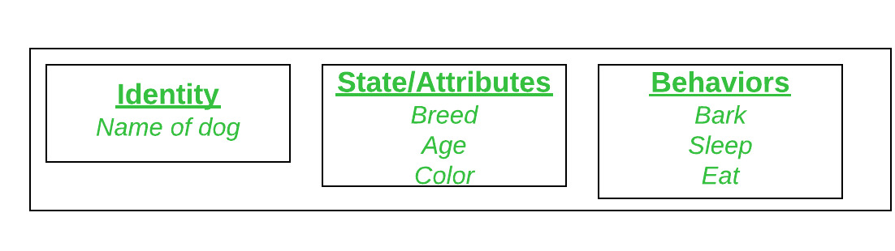

# C# Program Structure

In this chapter, You will learn about the below C# Classes:

- [C# Program Structure](#c-program-structure)
    - [Declaring Classes](#declaring-classes)
    - [Creating objects](#creating-objects)
    - [Class inheritance](#class-inheritance)
      - [Points to remember](#points-to-remember)

A type that is defined as a class is a **reference** type. At run time, when you declare a variable of a reference type, the variable contains the value `null` until you explicitly create an instance of the class by using the `new` operator. When the object is created, enough memory is allocated on the managed heap for that specific object, and the variable holds only a reference to the location of said object. 

Types on the managed heap require overhead both when they are allocated and when they are reclaimed by the automatic memory management functionality of the CLR, which is known as **garbage collection**. However, garbage collection is also highly optimized and in most scenarios, it does not create a performance issue.

### Declaring Classes
Classes are declared by using the class keyword followed by a unique identifier, as shown in the following example:

```cs
//[access modifier] - [class] - [identifier]
public class Customer
{
   // Fields, properties, methods and events go here...
}
```

### Creating objects

A class and an object are different things. A class defines a type of object, but it is not an object itself. An object is a concrete entity based on a class, and is sometimes referred to as an instance of a class.

Object is a basic unit of Object-Oriented Programming and represents real-life entities. A typical C# program creates many objects, which as you know, interact by invoking methods. An object consists of : 

* **State**: It is represented by attributes of an object. It also reflects the properties of an object.
* **Behavior**: It is represented by the methods of an object. It also reflects the response of an object with other objects.
* **Identity**: It gives a unique name to an object and enables one object to interact with other objects.

Consider Dog as an object and see the below diagram for its identity, state, and behavior:




Objects can be created by using the new keyword followed by the name of the class that the object will be based on, like this:

```cs
Customer object1 = new Customer();
```

When an instance of a class is created, a reference to the object is passed back to the programmer. In the previous example, `object1` is a reference to an object that is based on `Customer`. This reference refers to the new object but does not contain the object data itself. In fact, you can create an object reference without creating an object at all:

```cs
Customer object2;
 ```

 We don't recommend creating object references such as the preceding one that don't refer to an object because trying to access an object through such a reference will fail at run time. However, such a reference can be made to refer to an object, either by creating a new object, or by assigning it an existing object, such as this:

```cs
Customer object1 = new Customer();
Customer object2 = object1;
 ```

 This code creates two object references that both refer to the same object

 ### Class inheritance

 Classes fully support `inheritance`, a fundamental characteristic of object-oriented programming. When you create a class, you can inherit from any other class that is not defined as `sealed`, and other classes can inherit from your class and `override` class `virtual` methods. Furthermore, you can implement one or more interfaces.

```cs
public class Manager : Employee
{
    // Employee fields, properties, methods and events are inherited
    // New Manager fields, properties, methods and events go here...
}
```

#### Points to remember
* When a class declares a base class, it inherits all the members of the base class except the constructors
* A class in C# can only directly inherit from one base class
* But, a class can directly implement one or more interfaces
* A class can be declared `abstract`. 
* An `abstract` class contains abstract methods that have a signature definition but no implementation.
* Abstract classes cannot be instantiated
* They can only be used through derived classes that implement the abstract methods.
* By contrast, a `sealed` class does not allow other classes to derive from it.
* Class definitions can be split between different source files using partial classes and partial methods

The following example defines a public class that contains `auto-implemented properties`:

```cs
namespace CSharpKeywords
{
    public class Person
    {
        public Person(string firstName, string lastName, string mobileNumber, string location)
        {
            FirstName = firstName;
            LastName = lastName;
            MobileNumber = mobileNumber;
            Location = location;
        }

        public string FirstName { get; set; }
        public string LastName { get; set; }
        public string MobileNumber { get; set; }
        public string Location { get; set; }
    }

    public class Program
    {
        static void Main(string[] args)
        {
            //  Creating new instance for person class
            Person person = new Person("Arun", "Kumar", "999-999-9999", "Madhavaram"); 

            Console.WriteLine(person.FirstName);
            Console.WriteLine(person.LastName);
            Console.WriteLine(person.MobileNumber);
            Console.WriteLine(person.Location);
        }      
    }  
}
/* Output
Arun
Kumar
999-999-9999
Madhavaram
*/
```