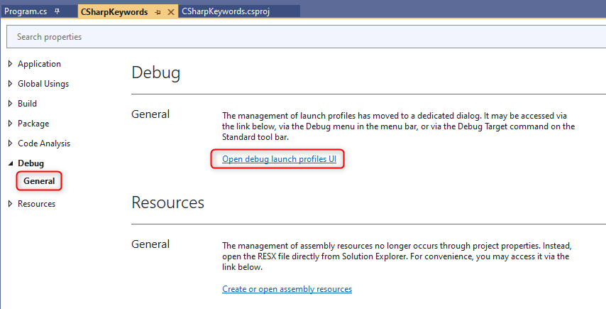
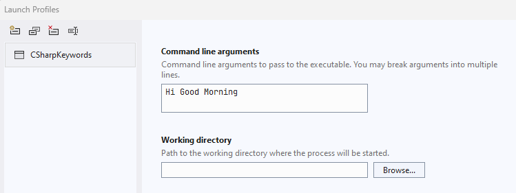

# C# Program Structure

In this chapter, You will learn about the below C# Program Structure: 

- [C# Program Structure](#c-program-structure)
    - [General Structure of C# Program](#general-structure-of-c-program)
    - [Main() method and Command Line Arguments](#main-method-and-command-line-arguments)
      - [Points to remember](#points-to-remember)
      - [Command Line Arguments](#command-line-arguments)
    - [Top Level Statements (programs without `Main` method)](#top-level-statements-programs-without-main-method)
      - [using directives](#using-directives)
      - [args](#args)
      - [await](#await)
      - [Exit code for the process](#exit-code-for-the-process)


### General Structure of C# Program

* C# programs consist of one or more files. 
* Each file contains zero or more namespaces.

A `namespace` contains types such as:
  * `classes`
  * `structs`
  * `interfaces`
  * `enumerations`
  * `delegates`
  * `namespace`

The following example is the skeleton of a C# program that contains all of these elements.

```cs
// A skeleton of a C# program
using System;
namespace YourNamespace
{
    class YourClass
    {
    }

    struct YourStruct
    {
    }

    interface IYourInterface
    {
    }

    delegate int YourDelegate();

    enum YourEnum
    {
    }

    namespace YourNestedNamespace
    {
        struct YourStruct
        {
        }
    }

    class Program
    {
        static void Main(string[] args)
        {
            //Your program starts here...
            Console.WriteLine("Hello world!");
        }
    }
}
```
### Main() method and Command Line Arguments

* The `Main` method is the entry point of a C# application. 
* When the application is started, the `Main` method is the first method that is invoked.
* There can only be one entry point in a C# program
* If you have more than one class that has a `Main` method, you must compile your program with the **StartupObject** compiler option to specify which `Main` method to use as the entry point

#### Points to remember
* The `Main` method is the entry point of an executable program
* `Main` is declared inside a `class` or `struct`
* `Main` must be `static` and it need not be `public`
* `Main` can either have a `void`, `int`, `Task`, or `Task<int>` return type.
* If `Main` returns a `Task` or `Task<int>`, the declaration of Main may include the `async` modifier
* The `Main` method can be declared with or without a `string[]` parameter that contains command-line arguments

The following list shows valid `Main` signatures:

```cs
public static void Main() { }
public static int Main() { }
public static void Main(string[] args) { }
public static int Main(string[] args) { }
public static async Task Main() { }
public static async Task<int> Main() { }
public static async Task Main(string[] args) { }
public static async Task<int> Main(string[] args) { }
```

#### Command Line Arguments

`Command Line Arguments` can be set in the `Debug` tag in the project's `Properties` window:

The following program demonstates how to pass command-line arguments to your application:

```cs
public class Program
{
    static void Main(string[] args)
    {
        if (args.Length == 0)
        {
            Console.WriteLine("No arguments passed");
        }
        else 
        {
            foreach (string arg in args)
            {
                Console.WriteLine($"argument:{arg}");
            }
        }
    }      
} 
```
* Right-click on your project in solution explorer and go to properties
* Navigate to `Debug`->`General`
* Click `Open debug launch profiles UI`



Launch profile window will open. Pass the arguments in command line arguments text box as given below:



**Run the program**

Now run the program with arguments. The arguments will be parsed  in the `Main` method and will be displayed in the output:

```cs
argument:Hi
argument:Good
argument:Morning
```
### Top Level Statements (programs without `Main` method)
* Starting in C# 9, you don't have to explicitly include a `Main` method in a console application project. 
* Instead, you can use the top-level statements feature to minimize the code you have to write. 
* In this case, the compiler generates a class and `Main` method entry point for the application.

Here's a Program.cs file that is a complete C# program in C# 10:

```cs
Console.WriteLine("Hello World!");
```

#### using directives
If you include using directives, they must come first in the file, as in this example:

```cs
using System.Text;

StringBuilder builder = new();
builder.AppendLine("Hello");
builder.AppendLine("World!");

Console.WriteLine(builder.ToString());
```
#### args
Top-level statements can reference the args variable to access any command-line arguments that were entered. The args variable is never null but its Length is zero if no command-line arguments were provided. For example:

```cs
if (args.Length > 0)
{
    foreach (var arg in args)
    {
        Console.WriteLine($"Argument={arg}");
    }
}
else
{
    Console.WriteLine("No arguments");
}
```

#### await
You can call an `async` method by using `await`. For example:

```cs
Console.Write("Hello ");
await Task.Delay(5000);
Console.WriteLine("World!");
```

#### Exit code for the process
To return an `int` value when the application ends, use the `return` statement as you would in a `Main` method that returns an `int`. For example:

```cs
string? s = Console.ReadLine();
int returnValue = int.Parse(s ?? "-1");
return returnValue;
```