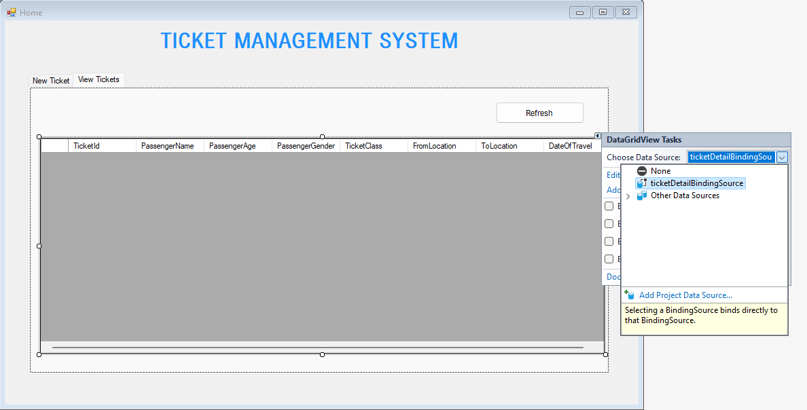
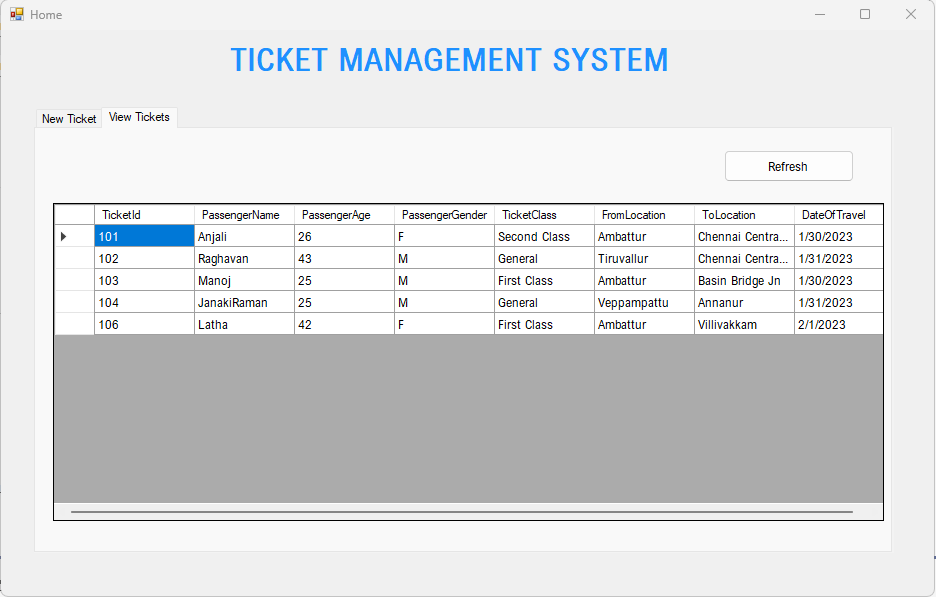

# Windows Form Application with Entity Framework

In this chapter, we will learn the below:

* To create a Windows Form Application for Train Ticket Management System
* Create Ticket Management System database in MS SQL Server
* Use Entity Framework to perform database operation from the windows app

### Introduction

Windows Forms is a **UI framework** for building Windows desktop apps. It provides one of the most productive ways to create desktop apps based on the visual designer provided in Visual Studio. Functionality such as drag-and-drop placement of visual controls makes it easy to build desktop apps. With Windows Forms, you develop graphically rich apps that are easy to deploy, update, and work while offline or while connected to the internet. Windows Forms apps can access the local hardware and file system of the computer where the app is running.


In Windows Forms, a `form` is a visual surface on which you display information to the user. You ordinarily build Windows Forms apps by adding controls to forms and developing responses to user actions, such as mouse clicks or key presses. A control is a discrete UI element that displays data or accepts data input.

When a user does something to your form or one of its controls, the action generates an `event`. Your app reacts to these events with code, and processes the events when they occur.
Windows Forms contains a variety of controls that you can add to forms: controls that display `text boxes`, `buttons`, `drop-down boxes`, `radio buttons`, and even `webpages`. If an existing control doesn't meet your needs, Windows Forms also supports creating your own custom controls using the `UserControl` class.

### Creating a new Windows Form Application

Lets create a Ticket Management System with the below functionality:

```
1. Create Ticket 
    -Creates a new ticket with the below details
        Passenger Name
        * Passenger Age
        * Passenger Gender
        * Ticket Class
        * From Location
        * To Location
        * Date Of Travel
2. View Tickets Sold
    - Lists all the tickets created
3. Search Ticket by ID
    - Search and view ticket details by ticket id
4. Update Ticket
    - Update existing ticket details
5. Cancelling Ticket
    - Delete the ticket
```
* Right Click Visual Studio Icon and select "**Run as Administrator**"
* Click "**Create a new project**"
* In the templates search box, enter "**Windows Forms**"
* In the list of templates, select "**Windows Forms App (.NET Framework)**" and click **Next**
* Enter project name as "**TicketManagementSystem**"
* Ensure framework is pointed to latest .NET version (Ex: **.NET Framework 4.8.1**) and click **Create**
* New windows form project will be created

#### Login Form
* In the solution explorer, rename the `Form1` as `Login` 
* Create the below form by dragging and dropping respective controls into the form
* Update the name fields of each control properly by going to `right-click`->`properties`->`Name` (For ex: `textbox_Username`,` textbox_Password`, `button_Submit`)
* `double-click` the submit button in the designer to create event in the code-behind file of login form
* Now create another form called `Home` by performing `right-click`->`Add`->`Form(Windows Forms)`

.png)

#### Code Behind (.cs) file for Login Form

* Enter the below code in `.cs` file of Login Form
* On `submit` button click, the below code checks:
  * Username is `admin`
  * Password is `admin@123`
* If entered credentials matches and login successful, it will show `Home` form
* If the credentials does not match, it will show as message box with text `"Invalid Credentials Entered By User!"`
* Run the application (**CTRL+F5**) and test if the login functionality works

```cs
public partial class Login : Form
{
    public Login()
    {
        InitializeComponent();
    }

    private void button_Submit_Click(object sender, EventArgs e)
    {
        if (textBox_Username.Text == "admin" && textBox_Password.Text == "admin@123")
        {
            Home home = new Home();
            home.Show();
        }
        else
        {
            MessageBox.Show("Invalid Credentials Entered By User!", "Invalid Credentials", MessageBoxButtons.OK, MessageBoxIcon.Exclamation);
        }
    }
}
```

#### Home Form

* Now that we created our login form, lets design and add controls to `Home` form
* Create the below home form with all the necessary controls
* Name the controls appropriately, so that it will be easy to access the controls in our code behind file

.png)
.png)

**Note:**

Add the below list of Stations for **From** and **To** **Location** Comboboxes:

```
Tiruvallur	
Putlur 
Sevvapet Road
Veppampattu
Tiruninravur
Nemilicherry
Pattabiram
Hindu College
Avadi
Annanur
Tirumullaivayil
Ambattur
Pattaravakkam
Korattur
Villivakkam
Perambur Loco Works
Perambur Carriage Works
Perambur (Chennai)
Vyasarpadi Jeeva
Basin Bridge Jn
Chennai Central Suburban
```
### Entity Framework

Lets understand what is **Entity Framework**

* Entity Framework is an **Object Relational Mapping (ORM)** framework.
* It is an enhancement to ADO.NET that gives developers an automated mechanism for accessing & storing the data in a database and working with the results in addition to `DataReader` and `DataSet`.
* As an O/RM, EF6 reduces the impedance mismatch between the relational and object-oriented worlds 
* It enables developers to write applications that interact with data stored in relational databases using strongly-typed .NET objects that represent the application's domain, and eliminating the need for a large portion of the data access "plumbing" code that they usually need to write.

**EF6 implements many popular O/RM features:**

* Mapping of POCO entity classes which do not depend on any EF types
* Automatic change tracking
* Identity resolution and Unit of Work
* Eager, lazy and explicit loading
* Translation of strongly-typed queries using LINQ (Language INtegrated Query)
* Rich mapping capabilities, including support for:
    * One-to-one, one-to-many and many-to-many relationships
    * Inheritance (table per hierarchy, table per type and table per concrete class)
    * Complex types
    * Stored procedures
* A visual designer to create entity models.
* A "Code First" experience to create entity models by writing code.
* Models can either be generated from existing databases and then hand-edited, or they can be created from scratch and then used to generate new databases.
* Integration with .NET Framework application models, including ASP.NET, and through databinding, with WPF and WinForms.
* Database connectivity based on `ADO.NET` and numerous providers available to connect to `SQL Server`, `Oracle`, `MySQL`, `SQLite`, `PostgreSQL`, `DB2`, etc.

### Create Database and Table

Before we create our Entity Model in our application, lets create our database first

```SQL
CREATE DATABASE TMSDB
GO

USE [TMSDB]
GO

CREATE TABLE [dbo].[TicketDetails](
	[TicketId] [int] IDENTITY(101,1) NOT NULL,
	[PassengerName] [varchar](50) NOT NULL,
	[PassengerAge] [int] NOT NULL,
	[PassengerGender] [char](1) NOT NULL,
	[TicketClass] [varchar](20) NOT NULL,
	[FromLocation] [varchar](50) NOT NULL,
	[ToLocation] [varchar](50) NOT NULL,
	[DateOfTravel] [date] NOT NULL,
 CONSTRAINT [PK_TicketDetails] PRIMARY KEY CLUSTERED 
(
	[TicketId] ASC
)WITH (PAD_INDEX = OFF, STATISTICS_NORECOMPUTE = OFF, IGNORE_DUP_KEY = OFF, ALLOW_ROW_LOCKS = ON, ALLOW_PAGE_LOCKS = ON, OPTIMIZE_FOR_SEQUENTIAL_KEY = OFF) ON [PRIMARY]
) ON [PRIMARY]
GO
```

### Adding Entity Data Model

Follow the below steps to add our "**TicketDetails**" entity using Entity Framework

* Enter the model name as "TicketDetails"

.png)
.png)
.png)
.png)
.png)
.png)
.png)
.png)
.png)
.png)
.png)

### Creating New Ticket

* Now that we have our Entity Data Model setup, let add the application logic for `Home` form
* Enter the below code for "`Create New Ticket`" button click event
* We will be creating new context object using `TMSDBEntities` which we created using Entity Data model wizard
* `context` will have all our entity which corresponds/maps to tables in the database
* `TicketDetail` is the Entity Data Model for `TicketDetails` table in database

.png)

```cs
private void button_CreateNewTicket_Click(object sender, EventArgs e)
{
    TicketDetail ticket = new TicketDetail()
    {
        PassengerName = textBox_PassName.Text,
        PassengerAge = Convert.ToInt32(textBox_PassAge.Text),
        PassengerGender = CheckGender(),
        TicketClass = comboBox_TicketClass.Text,
        FromLocation = comboBox_FromLocation.Text,
        ToLocation = comboBox_ToLocation.Text,
        DateOfTravel = dateTimePicker_DateOfTravel.Value
    };

    TMSDBEntities context = new TMSDBEntities();
    context.TicketDetails.Add(ticket);
    context.SaveChanges();

    ClearControls();

    MessageBox.Show("Ticket Created", "New Ticket", MessageBoxButtons.OK, MessageBoxIcon.Information);
}

private string CheckGender()
{
    if (radioButton_Male.Checked)
    {
        return "M";
    }
    else if (radioButton_Female.Checked)
    {
        return "F";
    }
    else
    {
        return "T";
    }
}

private void ClearControls()
{
    textBox_PassName.Text = string.Empty;
    textBox_PassAge.Text = string.Empty;
    radioButton_Male.Checked = false;
    radioButton_Female.Checked = false;
    radioButton_TransGender.Checked = false;
    comboBox_TicketClass.Text = string.Empty;
    comboBox_FromLocation.Text = string.Empty;
    comboBox_ToLocation.Text = string.Empty;
    dateTimePicker_DateOfTravel.Text = DateTime.Now.ToString();
}
```

### Search and Load Ticket

```cs
private void button_LoadTicketDetails_Click(object sender, EventArgs e)
{
    int searchTicketId = Convert.ToInt32(textBox_TicketId.Text);

    var ticketDetail = (from ticketEntry in context.TicketDetails
                        where ticketEntry.TicketId == searchTicketId
                        select ticketEntry).FirstOrDefault();

    if (ticketDetail != null)
    {
        textBox_PassName.Text = ticketDetail.PassengerName;
        textBox_PassAge.Text = ticketDetail.PassengerAge.ToString();

        if (ticketDetail.PassengerGender == "M")
        {
            radioButton_Male.Checked = true;
        }
        else if (ticketDetail.PassengerGender == "F")
        {
            radioButton_Female.Checked = true;
        }
        else
        {
            radioButton_TransGender.Checked = true;
        }

        comboBox_TicketClass.Text = ticketDetail.TicketClass;
        comboBox_FromLocation.Text = ticketDetail.FromLocation;
        comboBox_ToLocation.Text = ticketDetail.ToLocation;
        dateTimePicker_DateOfTravel.Value = ticketDetail.DateOfTravel;
    }
    else
    {
        MessageBox.Show("Ticket ID Not Found", "No Data", MessageBoxButtons.OK, MessageBoxIcon.Exclamation);
    }
}
```

### Update Ticket

```cs
private void button_UpdateTicket_Click(object sender, EventArgs e)
{
    int searchTicketId = Convert.ToInt32(textBox_TicketId.Text);

    var ticketDetail = (from ticketEntry in context.TicketDetails
                        where ticketEntry.TicketId == searchTicketId
                        select ticketEntry).FirstOrDefault();

    if (ticketDetail != null)
    {
        if (ticketDetail.TicketId == searchTicketId)
        {
            ticketDetail.PassengerName = textBox_PassName.Text;
            ticketDetail.PassengerAge = Convert.ToInt32(textBox_PassAge.Text);
            ticketDetail.PassengerGender = CheckGender();
            ticketDetail.TicketClass = comboBox_TicketClass.Text;
            ticketDetail.FromLocation = comboBox_FromLocation.Text;
            ticketDetail.ToLocation = comboBox_ToLocation.Text;
            ticketDetail.DateOfTravel = dateTimePicker_DateOfTravel.Value;
        }
    }

    context.SaveChanges();

    ClearControls();

    MessageBox.Show("Ticket Details Updated", "Update Ticket", MessageBoxButtons.OK, MessageBoxIcon.Information);
}
```
### Delete Ticket

```cs
private void button_DeleteTicket_Click(object sender, EventArgs e)
{
    if (!string.IsNullOrWhiteSpace(textBox_TicketId.Text))
    {
        DialogResult result = MessageBox.Show($"Do you want to delete ticket {textBox_TicketId.Text} ?", "Warning", MessageBoxButtons.YesNo, MessageBoxIcon.Warning);

        if (result == DialogResult.Yes)
        {
            int searchTicketId = Convert.ToInt32(textBox_TicketId.Text);

            var ticketDetail = (from ticketEntry in context.TicketDetails
                                where ticketEntry.TicketId == searchTicketId
                                select ticketEntry).FirstOrDefault();

            context.TicketDetails.Attach(ticketDetail);
            context.TicketDetails.Remove(ticketDetail);
            context.SaveChanges();

            ClearControls();

            MessageBox.Show($"Ticket with ID={searchTicketId} Deleted", "Delete Ticket", MessageBoxButtons.OK, MessageBoxIcon.Information);
        }                             
    }
}
```

### Refresh Ticket Details

* Add the below code for `Refresh` button click in **View Tickets** Tab
* Add the data source for dataGridView like below





```cs
private void button_RefreshData_Click(object sender, EventArgs e)
{
    dataGridView_TicketDetails.DataSource = context.TicketDetails.ToList();
    MessageBox.Show("Ticket Details Refreshed", "Refresh", MessageBoxButtons.OK, MessageBoxIcon.Information);
}
```